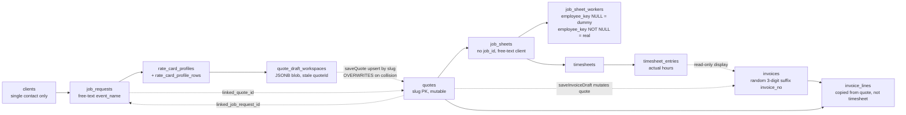
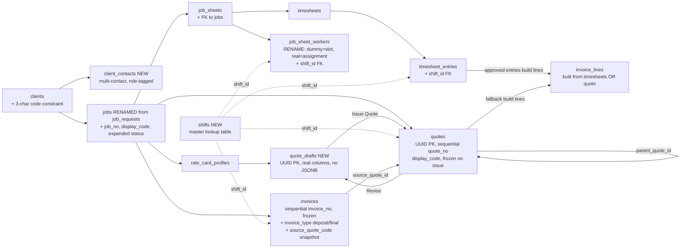

# System Flow Rewrite: Client → Invoice

**Status:** Design discussion document. Not an implementation plan yet — meant to align on the shape of the larger rewrite before we commit to migrations and code.

**Date:** 2026-04-28

---

## Context

Today's investigation of the Connor incident exposed a structural problem in the quote system (slug PKs, JSONB drafts, blind upserts) that we've already designed a fix for. But Connor's bug is one symptom of a broader pattern: identity is fuzzy across the entire client-to-invoice chain, several free-text fields act as junk drawers, and downstream tables (job sheets, invoices) carry their own copies of the slug-and-overwrite footgun.

This document traces the lifecycle of a job from client onboarding to final invoice, calls out where today's design is fragile, and proposes the changes that would harden it. The intent is alignment on scope before we plan migrations — particularly:

- A real `jobs` master entity. Today's `job_requests` table already holds ~90% of the shape we need (id, client_id, event_name, dates, venue, status, notes) — so this is best done as a **rename + extend of `job_requests`** rather than introducing a new sibling table. The "request" framing only fits the inquiry stage; once the job is confirmed/in-progress, the row should logically be a `jobs` row. (Updated 2026-04-28 after John's observation.)
- Multi-contact support per client (today there's a single contactName/email).
- Event name discipline (today event_name is a junk drawer holding addresses, dates, client names).
- Sequential numbering + uniqueness on invoices (today invoice_no is a random 3-digit suffix — collisions and `-DEP-DEP` corruption are baked in).
- Normalized shifts (today shift_label is free-form text in three tables).
- Invoice lines built from timesheets (today they're copied from the quote and the timesheet is display-only).
- Clarification on job sheets: workers, timesheets, and "dummy slots" are already three separate things in the schema — but the UI may obscure that.

---

## Current state



### Pain points (numbered for reference below)

1. **No `jobs` master table.** Job identity is virtual: `client + event_name + start_date + maybe job_sheet_id`. Cross-table joins fall back to text matching.
2. **Single contact per client.** `clients.contact_name`/`email`/`phone`. Can't email the AP clerk separately from the planner.
3. **`event_name` is a junk drawer.** We've seen "FEP Live, LLC — Pro Football Hall of Fame 2026 Enshrinement Week" and similar in the field. Dropdowns become unreadable.
4. **Quote slug PKs + JSONB drafts** — already designed for rewrite (see project_todo).
5. **`invoice_no` is `INV-{YYYY}-{MMDD}-{rand 100-999}`.** No DB unique constraint. Race-condition-prone. Deposit invoice appends `-DEP` to the same number — and we've already seen `INV-2026-0423-422-DEP-DEP` (deposit-of-a-deposit corruption).
6. **`shift_label` is free-form text** on `quote_lines`, `invoice_lines`, and effectively on `job_sheet_workers.role`. Drift is inevitable ("Shift 1" vs "shift 1" vs "AM Load In").
7. **Invoice lines are copied from the quote at generation time and stay manually editable.** Timesheet entries are read-only display in the invoice UI. Real labor actuals don't drive billing.
8. **Job sheet conceptual confusion** — see "On the job sheet 'three concerns' question" below. The schema already separates them; the UI conflates them.

---

## Proposed state



Key structural shifts:

- A `jobs` row is the spine. Everything else hangs off it.
- Quote drafts and quotes are physically separate tables (already designed).
- Invoices borrow the same number+freeze pattern as quotes.
- Shifts become a lookup table referenced by FK.
- Timesheet entries become the source of truth for invoice line generation when actuals exist.

---

## Per-entity changes

### 1. Clients

**Current** ([supabase/schema.sql:444](supabase/schema.sql:444)):
```
id (text PK), name, code, contact_name, bill_to, email, phone,
address, city, state, zip, notes, is_active
```

**Proposed:**
- Add CHECK constraint `length(code) = 3` (already in todo).
- Eventually deprecate `contact_name`/`email`/`phone` once `client_contacts` is in use — keep for back-compat during transition.
- Drop `bill_to` (already in todo; redundant once structured address fields are reliable).

### 2. Client Contacts (NEW)

**Why:** A real client has multiple roles — billing/AP, sales/quotes, logistics/site contact. Today we can't email a quote to one person and the deposit invoice to another. This is the foundation for the email-from-app feature.

**Schema:**
```
client_contacts (
  id text PK,
  client_id text FK -> clients(id),
  full_name text,
  email text,
  phone text,
  title text,
  role text CHECK (role in ('billing','quotes','sales','logistics','site','other')),
  is_primary boolean,
  notes text,
  is_active boolean
)
```

**UI:** Sub-section in Client Maintenance. List + add/edit modal. The "primary" contact populates the legacy single-contact fields on `clients` for backward compatibility during migration.

**Downstream uses:** Quote/invoice email flow looks up the contact whose `role` matches the document type — `quotes` for an estimate, `billing` for an invoice. Each is editable at send time.

### 3. Jobs (rename + extend `job_requests`)

**Why a rename, not a new table:** `job_requests` already holds the data shape we need for a job master entity — id, client_id (FK migration in progress), event_name, venue, dates, status, notes, and `linked_quote_id`. Creating a separate `jobs` table on the side would duplicate all of that and force a 1:1 FK between two tables that represent the same thing. The cleaner move is to rename the table to `jobs`, extend it with the few missing columns, and let the existing `id` continue to serve as the job's stable identity.

**Current shape** ([supabase/schema.sql:151](supabase/schema.sql:151)):
```
job_requests (
  id, client_id, client (text), event_name, venue, venue_address, city_state,
  google_maps_link, received_date, request_date (event start), end_date,
  start_time, end_time, expected_hours, add_to_calendar, status, notes,
  attachment_names, packet_notes, linked_quote_id
)
```

**Proposed changes (rename to `jobs`, additive):**
```
jobs (
  -- everything from job_requests, plus:
  job_no int UNIQUE,               -- sequential from a global Postgres SEQUENCE
  display_code text,               -- e.g. LNC-00042 — mirrors quotes display_code style
  -- expanded status enum (was free-text):
  status text CHECK (status in
    ('inquiry','quoted','confirmed','in_progress','completed','cancelled')),
  -- short, disciplined event_name (UI-enforced max ~40 chars)
)
```

**Lifecycle (unchanged in spirit, just clearer status):**
- Row created when a request comes in. Initial status = `inquiry`.
- Status advances as the job moves: `inquiry → quoted → confirmed → in_progress → completed`.
- Downstream records (`quotes`, `job_sheets`, `invoices`, `timesheets`) carry `job_id` FK to `jobs(id)`.
- For jobs that start without a formal request (admin enters a quote directly), a `jobs` row is created on first quote-draft-save with status = `inquiry` immediately. So the entry point is always the same row regardless of origin.

**Drop / cleanup:**
- Drop the denormalized `client` text column (already in todo).
- Apply event_name discipline — short field, helper text, audit existing long values for shortening.
- `linked_quote_id` becomes redundant once `job_id` is on `quotes` (you can do the reverse lookup); keep optionally as a denormalized "current quote" pointer for fast UI rendering.

**Migration:** No new table to populate — existing `job_requests` rows become `jobs` rows in place via the rename. Backfill: assign `job_no` in created_at order, compute `display_code`, normalize `status` values into the new enum (anything outside the enum gets mapped to a sensible default, surfaced in an audit query for human review). Then add the `job_id` FK columns to the downstream tables and backfill them from each table's existing `linked_*_id` references and string-matching where needed.

### 5. Rate Cards

**Current** ([supabase/schema.sql:411](supabase/schema.sql:411)):
- `rate_card_profiles` and `rate_card_profile_rows` are already normalized.
- Rates are **snapshotted** into `quote_lines.base_hourly`/`base_day`/`ot_rate`/`dt_rate` at quote creation. Updating the rate card does **not** retroactively change historical quotes — that's correct behavior for billing integrity.

**Proposed changes:** None for now. The rate card layer is in good shape. We will continue to snapshot rates into quote_lines and invoice_lines at the moment of creation.

### 6. Quote Drafts (NEW table) and Quotes

**Already designed** in earlier session. Recap:

- `quote_drafts` — UUID PK, all columns proper, no JSONB. Lines in `quote_draft_lines`. Manual delete only.
- `quotes` — UUID PK, `quote_no` from a global Postgres SEQUENCE, `display_code` like `LNC-miami-commencement-00042`, `parent_quote_id` for revision chains, `status` enum (`issued | signed | superseded`), DB-enforced read-only on content columns, lines in `quote_lines`.
- "Issue Quote" promotes draft → quote (atomic INSERT into quotes + DELETE draft).
- "Revise" clones a frozen quote into a new draft.
- Every quote also carries `job_id` FK.

**Quote pulls event info from the job — does NOT copy it.** (Updated 2026-04-29 from John's observation.) Today the quote duplicates `client`, `event_name`, `venue`, `city_state`, `start_date`, `end_date`, `start_time`, `end_time` from the job request. Pure denormalization with no benefit and lots of drift risk — typo a venue on the quote and the job request still says the old name; reschedule on the request and the quote is silently outdated.

In the rewrite:
- `quote_drafts` and `quotes` carry **only** `job_id` FK plus quote-specific fields (`deposit_pct`, `terms`, `signature_name`/`signed_at`, `rate_card_profile_id`, `quote_no`/`display_code`/`status`/etc., line items via child table). Drop the duplicated event-info columns entirely.
- The quote builder UI replaces the free-form client/event/venue/date inputs with a **single "Job" dropdown** populated from `jobs` (the renamed `job_requests`). Picking a job populates the read-only event panel below the dropdown, showing client, event, venue, dates, etc. live-read from the job row. If the job's info changes upstream (e.g. venue updated on the job), every draft and quote tied to it reflects the change immediately.
- Display in the quote PDF / list / detail view does a join to `jobs` at render time. No client-side string-matching or stale snapshots.

**Freeze interaction:** because issued quotes are frozen rows in their own right (immutable status, lines, totals, signatures), the only thing that could "change" on a frozen quote is the upstream job. To preserve historical accuracy, jobs themselves should freeze their core content when status advances to `confirmed` (or earlier — when the first quote is issued against them). Status transitions stay editable; client_id/event_name/dates/venue lock down. That gives single-source-of-truth AND audit accuracy without any snapshotting on the quote side.

**Migration:** the column drops on `quotes` happen after `job_id` is backfilled and verified. Existing rows whose `job_id` would resolve to a renamed/updated job get an audit query so a human can verify the join is correct before the source columns are removed.

**Same pattern applies to invoices** — see Section 11.

### 7. Job Sheets

**Current** ([supabase/schema.sql:296](supabase/schema.sql:296)):
- `id`, `source_event_id`, `title`, `client` (free-text), `event_name`, `venue`, `date`, `call_time`, `notes`, `attachment_names`.
- No `client_id` FK (already flagged in todo: "Normalize job_sheets to client_id").
- No `job_id` FK.

**Proposed changes:**
- Add `client_id` FK (per existing todo).
- Add `job_id` FK → `jobs(id)`. This is the user's "we don't have a job id" point.
- Apply event_name discipline.
- Drop `client` text once `client_id` is the source of truth.
- Consider adding `quote_id` FK so the job sheet can look up the source quote directly (today: `quotes.linked_job_sheet_id` does the reverse, which is awkward when starting from a job sheet).

### 8. On the job sheet "three concerns" question

You asked whether dummy placeholders, real assigned crew, and timesheets are smashed into one table. **They aren't — the schema already separates them, but the UI may suggest otherwise.** The exploration confirmed:

| Concern | Where it lives | How distinguished |
|---|---|---|
| Dummy placeholder ("we need 4 stagehands, no names yet") | `job_sheet_workers` row | `employee_key IS NULL`, `full_name` is "TBD" or similar |
| Real assigned crew (employee X is on this slot) | `job_sheet_workers` row | `employee_key IS NOT NULL`, links to `employees` |
| Actual hours worked | `timesheet_entries` row | Separate table, FK to both `timesheets` and `job_sheets` |

So `job_sheet_workers` and `timesheet_entries` are **two different tables**. Within `job_sheet_workers`, dummy vs assigned is a single nullable FK column.

**My recommendation:** Don't split `job_sheet_workers` further. The placeholder/assignment distinction is conceptually one thing — "the slot, optionally filled" — and a nullable FK models that cleanly. But:

- **Rename the columns/UI labels** to make the distinction obvious. e.g. UI section "Crew Slots" with empty rows shown as "Open — assign someone" and filled rows as the employee's name.
- **Add a `slot_status` derived column** (or computed in app) so the dashboard's understaffed query becomes `count(*) where employee_key IS NULL` per job sheet — simpler than today's confirmation flag check.

The timesheet split (separate table) is correct — actuals are a fundamentally different concept from roster planning. Keep as-is.

### 9. Shifts (NEW lookup table)

**Current:** Free-form `shift_label` text on:
- `quote_lines.shift_label` ([supabase/schema.sql:80](supabase/schema.sql:80))
- `invoice_lines.shift_label` ([supabase/schema.sql:141](supabase/schema.sql:141))
- Effectively on `job_sheet_workers.role` (text)
- Effectively on `timesheet_entries.position` (text — this is doing double duty as position-name AND shift label in some cases)

Already in project_todo as "Normalize Shift with a lookup table."

**Proposed:**
```
shifts (
  id text PK,
  name text UNIQUE,                -- e.g. "Load In", "Show Call", "Strike"
  sort_order int,
  is_active boolean
)
```

- Add `shift_id` FK to `quote_lines`, `invoice_lines`, `job_sheet_workers`, `timesheet_entries`.
- Keep `shift_label` text as a snapshot for back-compat and historical legibility.
- UI: replace the free-text input with a dropdown driven by the `shifts` master, with an "Add new shift" affordance gated to an admin role.

**Migration:** Seed `shifts` from distinct trim/lower values currently in `quote_lines.shift_label` plus the venue-code values we've seen (`YAGER`, `GOGGIN`). Decision needed: are venue codes like `YAGER` really shifts, or are they being misused as shift labels because the field is free? My read is the latter — they're venue codes, and the shift was something more like "Show Call at Yager." We'll need to disambiguate during migration.

### 10. Timesheets

**Current** ([supabase/schema.sql:335](supabase/schema.sql:335)):
- `timesheets` — wraps a job sheet's labor records.
- `timesheet_entries` — one row per worker per timesheet, with time_in/time_out, std/ot/dt hours, std/ot/dt rates, total_pay.

**Proposed changes:**
- Add `job_id` FK (denormalization for fast cross-job queries).
- Add `shift_id` FK to entries (replaces today's free-form `position`/derived shift).
- Add a `status` column to the entry (`submitted | approved | rejected | invoiced | locked`) so we can track "this entry has been invoiced and is now immutable." (The "locked" status fires when a payroll run includes the entry, which is a separate todo.)
- **Audit columns (behind the scenes — not surfaced in UI initially)** for tracking who did what and when:
  - On `timesheets`: `created_at`, `created_by` (user_id of admin who built the timesheet).
  - On `timesheet_entries`: `submitted_at`/`submitted_by`, `approved_at`/`approved_by`, `rejected_at`/`rejected_by`. Each pair is populated atomically when the corresponding status transition happens. `*_by` columns are FKs to `auth.users(id)`.
  - These are write-only from the app's perspective for now — populated automatically by the status-change handlers in `lib/store/db.ts`. Display in any admin UI is a follow-on task. The point right now is the data exists for forensic queries (e.g. "who approved this rejected entry, and when?") if we ever need it.
  - Pattern can later be applied to quotes (issued_at/by, superseded_at/by) and invoices (sent_at/by, paid_at/by) if desired — captured here as the precedent for "status changes are auditable."

### 11. Invoices

**Current** ([supabase/schema.sql:98](supabase/schema.sql:98)):
- `invoice_no` generated client-side as `INV-{YYYY}-{MMDD}-{rand 100-999}` ([quote-builder.tsx:687](components/shared/quote-builder.tsx:687)).
- No DB unique constraint on `invoice_no`.
- Deposit invoice generation appends `-DEP` to an existing invoice's number ([invoice-builder.tsx:536](components/shared/invoice-builder.tsx:536)) — this is how `INV-2026-0423-422-DEP-DEP` was produced (a deposit was generated against an already-deposit invoice).
- `quote_id` is text without FK to `quotes`.
- `linked_job_sheet_id` is text without FK to `job_sheets`.
- `lines` JSONB column is deprecated; real lines in `invoice_lines`.

**Proposed:**

Mirror the quote rewrite. Invoices get the same numbering + freeze treatment.

```
invoices (
  id uuid PK,
  job_id text FK -> jobs(id),
  quote_id uuid FK -> quotes(id),
  source_quote_code text,                 -- snapshot of quote.display_code at invoice time
  invoice_no int UNIQUE,                  -- sequential from a global SEQUENCE
  display_code text,                       -- e.g. INV-2026-00042 — Connor's preferred format
  invoice_type text CHECK (invoice_type in ('deposit','final')),
  parent_invoice_id uuid FK -> invoices(id),  -- for revisions, like quotes
  status text CHECK (status in ('issued','sent','paid','superseded','void')),
  issue_date, due_date, ...
  -- content columns frozen via RLS once status != 'draft'
)
```

**Number format:** Connor wants a specific format — placeholder `INV-{YYYY}-{seq:05d}` here, to be confirmed with him. Sequential allocation eliminates the random-suffix collision class.

**Deposit handling:** A deposit invoice is `invoice_type = 'deposit'`. It has its own `invoice_no` from the global sequence. The `-DEP` string suffix goes away entirely. To find "all invoices for this job," query by `job_id`. To distinguish, query by `invoice_type`. The `parent_invoice_id` lets you chain a final invoice that supersedes a deposit.

**Freeze:** Once issued, `status != 'draft'` and content columns can't be updated. Revising creates a new invoice row pointing at the parent, just like quotes. The `INV-2026-0423-422-DEP-DEP` corruption pattern becomes mechanically impossible.

**Pull event info from job, do NOT copy.** Same principle as quotes (Section 6). Today's invoice has duplicated `client`, `event_name`, `venue`, `city_state`, `bill_to` columns — drop them from the schema. The new `invoices` row carries `job_id` (and `quote_id` for the source quote), and the invoice PDF / list / detail view reads event info via join. Single source of truth, no drift, no copy-on-generate logic. The job's frozen status (locked when it advances past inquiry/quoted) preserves audit accuracy.

### 12. Invoice Lines — built from timesheets

**Current:**
- `invoice_lines` rows are copied from `quote_lines` when an invoice is generated ([invoice-builder.tsx:460](components/shared/invoice-builder.tsx:460): `lines: quote.lines.map(line => ({ ...line }))`).
- Approved `timesheet_entries` are summarized into `invoice.timesheet_summary` JSONB and **displayed read-only** in the invoice UI. They do not become invoice line rows.
- Result: the invoice bills what the **quote** estimated, not what was actually worked.

**Proposed flow:**
1. **Deposit invoice:** still derived from the quote — the deposit is the agreed-upon advance, not actuals. No change here.
2. **Final invoice:**
   - If approved timesheet entries exist for the job → `invoice_lines` are built from those entries.
     - One line per (date × position × specialty × shift × rate tier).
     - Hours from timesheet `std_hours`/`ot_hours`/`dt_hours`/holiday_hours.
     - Rates from the quote's snapshot rates (so the rate card history is honored).
     - `total = qty × hours × applied_rate + holiday_premium + travel`.
   - If no timesheet entries (e.g. flat-fee job, day rate), fall back to copying quote lines.
   - Mark each consumed timesheet entry's `status = 'invoiced'` so it can't be silently re-billed.
3. **UI:** the invoice builder shows generated lines in a read-only table by default with an "Override" toggle for the rare manual adjustment. Manual edits are tracked in an audit log column (`source_kind = 'timesheet' | 'quote_line' | 'manual_override'`).

This makes the invoice reflect the **actuals** and turns the timesheet from a display widget into a billing source of truth. Keeps the rate-snapshot integrity (no live rate-card lookup at billing time).

---

## Cross-cutting concerns

### Numbering + freeze pattern (applies to quotes and invoices)

Both quotes and invoices adopt the same pattern:

- **Allocation:** global Postgres SEQUENCE issues monotonic integers. No race conditions, no collisions, no DB-enforced uniqueness needed beyond `UNIQUE` on the column.
- **Display code:** snapshot computed once at issue time, frozen with the row.
- **Freeze:** content columns become read-only via RLS once `status` advances past `draft`. The "saving an invoice silently mutates the quote" code path that destroyed Connor's quote becomes structurally impossible because the source quote has no UPDATE policy.
- **Revisions:** explicit "Revise" action clones the frozen row into a new draft (separate table) which on issue becomes a new row with `parent_*_id` set. The original row stays as superseded historical record.

### Event name discipline

`event_name` becomes a short, focused field across `jobs` (renamed from `job_requests`), `quotes`, `job_sheets`, `invoices`. UI input enforces a max length (proposed 40 chars) with helper text: "Just the event itself — no client name, no dates, no venue. Examples: 'Spring Commencement', 'Warrior Conference', 'HOF Enshrinement'."

Existing rows are left alone but flagged in a one-time audit query so a human can shorten the worst offenders. Dropdown labels then become readable: `LNC | 2026-05-11 | Miami Commencement | #00042` instead of the wall of text we have today.

### Email automation

Once `client_contacts` exists, "Send Quote" / "Send Invoice" buttons can pre-fill the recipient from `client_contacts` filtered by role:

- Quote → contact with role `quotes` (fallback: `sales`, then primary)
- Deposit invoice → contact with role `billing` (fallback: primary)
- Final invoice → contact with role `billing`

Server-side PDF generation (Puppeteer in a Supabase Edge Function) + transactional email (Resend / Postmark / Supabase SMTP). Each send writes an `email_log` row for audit. This is a follow-on todo, not part of the structural rewrite — but the schema should support it from day one.

---

## Summary of new/changed tables

| Table | Status | Why |
|---|---|---|
| `clients` | minor | 3-char `code` constraint |
| `client_contacts` | NEW | Multi-contact + role |
| `jobs` (rename of `job_requests`) | rename + extend | Add `job_no` (sequential), `display_code`, expanded `status` enum; drop `client` text; apply event_name discipline; freeze content columns once status advances past inquiry/quoted (so quotes/invoices reading from this row stay audit-accurate). Existing rows become `jobs` rows in place. |
| `shifts` | NEW | Lookup, replace free-text shift labels |
| `quote_drafts` | NEW | Replaces `quote_draft_workspaces` JSONB |
| `quote_draft_lines` | NEW | Mirrors `quote_lines` for drafts |
| `quotes` | rewrite | UUID PK, sequential `quote_no`, `display_code`, `parent_quote_id`, `status` enum, frozen, + `job_id`; **drop duplicated event-info columns** (`client`, `event_name`, `venue`, `city_state`, `start_date`/`end_date`, `start_time`/`end_time`) — pull from `jobs` via FK |
| `quote_lines` | minor | + `shift_id` FK |
| `job_sheets` | minor | + `client_id` FK, + `job_id` FK; drop `client` text |
| `job_sheet_workers` | minor | + `shift_id` FK; UI relabel for slot/assignment |
| `timesheets` | minor | + `job_id` FK; + `created_at`/`created_by` audit |
| `timesheet_entries` | minor | + `shift_id` FK; + `status` (submitted/approved/rejected/invoiced/locked); + `submitted_at`/`by`, `approved_at`/`by`, `rejected_at`/`by` audit |
| `invoices` | rewrite | UUID PK, sequential `invoice_no`, `display_code`, `invoice_type`, `parent_invoice_id`, `source_quote_code`, frozen, + `job_id` FK, FK to `quotes`; **drop duplicated event-info columns** (`client`, `event_name`, `venue`, `city_state`, `bill_to`) — pull from `jobs` via FK |
| `invoice_lines` | minor | + `shift_id` FK; + `source_kind` audit column |

Tables to drop after migration: `quote_draft_workspaces`. The `-DEP` suffix convention on `invoices.invoice_no` goes away.

---

## Open questions for discussion

1. **Direct-quote entry path.** Since `job_requests` is being renamed to `jobs`, the lifecycle for inbound requests is unchanged (the row already exists). The remaining question is what happens when an admin starts a quote *without* a request first: should the "New Quote Draft" action auto-create a `jobs` row in `inquiry` status, or should it require a request to exist first? My lean: auto-create. Avoids forcing busywork on admins who are working from a phone call or walk-in.

2. **Job numbering.** Do jobs get a human display code like `JOB-LNC-00042` (parallel to quotes/invoices), or do we just use the quote's display code as the human ID and have `jobs.id` be UUID-only behind the scenes? Either works — the latter is simpler.

3. **Connor's invoice number format.** What's the format he prefers? `INV-2026-00042`? `INV-26-00042`? Per-client like `LNC-INV-00042`? Need this before we design the invoice rewrite.

4. **Shifts vs venue codes.** The `YAGER` / `GOGGIN` values we saw in the Miami Commencement quote PDF look like venue codes being misused as shift labels. During the shifts migration, do we (a) preserve them as shifts, (b) move them to a separate `venue_code` field on the line, or (c) merge them into a "shift instance" concept that's `shift × venue × time`?

5. **Timesheet → invoice line semantics.** When a timesheet has been approved but the rates have drifted from the quote (e.g. someone bumped the rate card mid-job), do we use:
   - The quote's snapshot rates (preserves quoted price, may not match what we paid the worker)
   - The timesheet's stored rates (matches payroll, may diverge from quote)
   - Both, with a reconciliation column showing the variance?

6. **Auto-promote draft to quote when invoice generated?** Today `saveInvoiceDraft` calls `saveQuote` first as a side effect — that's the bug. In the new model with frozen quotes, generating an invoice requires an issued quote. Should "Generate Invoice" from a draft prompt the user to "Issue Quote first?" Or auto-issue silently?

7. **Migration ordering.** This document covers a lot. We probably ship in phases:
   - Phase A (high priority): Quote rewrite + Connor recovery (already designed).
   - Phase B: `job_requests` → `jobs` rename + extend (`job_no`, `display_code`, status enum, event_name discipline). Add `job_id` FK to downstream tables and backfill. Migration is mostly a rename and additive columns rather than a wholesale new-table population.
   - Phase C: Invoice rewrite (numbering, freeze, type column).
   - Phase D: Shifts normalization.
   - Phase E: Client contacts + email automation.
   - Phase F: Timesheet-driven invoice lines.

   Order makes sense? Or different priorities?

---

## Files referenced (for future implementation)

- [supabase/schema.sql](supabase/schema.sql) — full schema for all tables involved.
- [components/shared/quote-builder.tsx](components/shared/quote-builder.tsx) — quote save/load, slug generation, invoice generation side effect.
- [components/shared/invoice-builder.tsx](components/shared/invoice-builder.tsx) — invoice number generation, deposit suffix logic, timesheet display.
- [lib/store/db.ts](lib/store/db.ts) — `upsertQuote`, draft workspace handlers, mergeClients.
- [lib/store/types.ts](lib/store/types.ts) — TS types for JobSheetWorker, TimesheetEntry, etc.

---

## Verification when implementing (per phase)

For each phase, the smoke tests are:

- Schema migration applies cleanly to dev Supabase, then prod.
- Existing UI screens that read the affected tables still render without errors.
- Cross-table joins that previously fell back to string matching now use FKs.
- Audit queries (slug-mismatch for quotes, dup-detection for invoices) return zero rows after migration.
- For Phase F: invoice totals built from timesheets reconcile against the quote's expected total, with variance reported.

---

This is a discussion document. Before any code lands, we should: align on the open questions above, confirm phase ordering, and (per today's earlier session) stand up the dev environment so all of this can be rehearsed safely.
